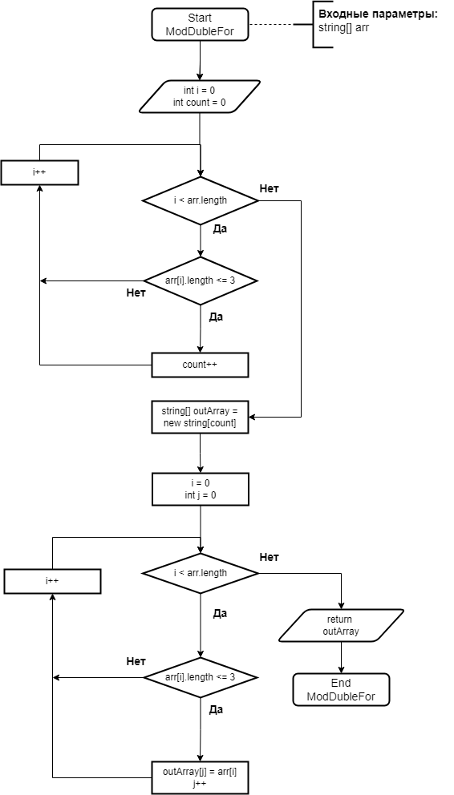

# Пишем программу, которая из сгенерированого массива строк формирует массив строк, длинна которых меньше либо равна 3 символа.

## Материалы

- Блок-схема алгоритма
- Код программы на C#

## Реализация

1. С помощью метода GenArray создаем случайный массив размером от 20 до 50 из элементов строк длинной от 2 до 9 символов из букв английского алфавита от (a-z) и цифр (0-9).
2. Выводим массив в консоль с помощью метода Print.
3. Обрабатываем массив с помощью метода ModDubleFor, в котором сначало обходим массив и определяем сколько элементов имеют длинну менше либо равно 3, тем самым определяем размер массива на выходе.
4. Создаем новый массив нужного размера. Заново обойдя входной массив, наполняем вновь созданный элементами рдлина которых меньше либо равна 3.
5. Выводим модифицированный массив в консоль с помощью метода Print.

## Блок схема алгоритма

